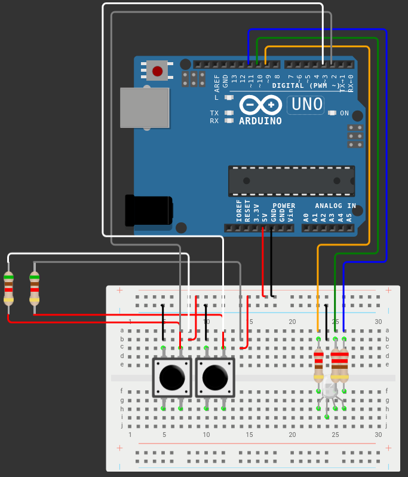
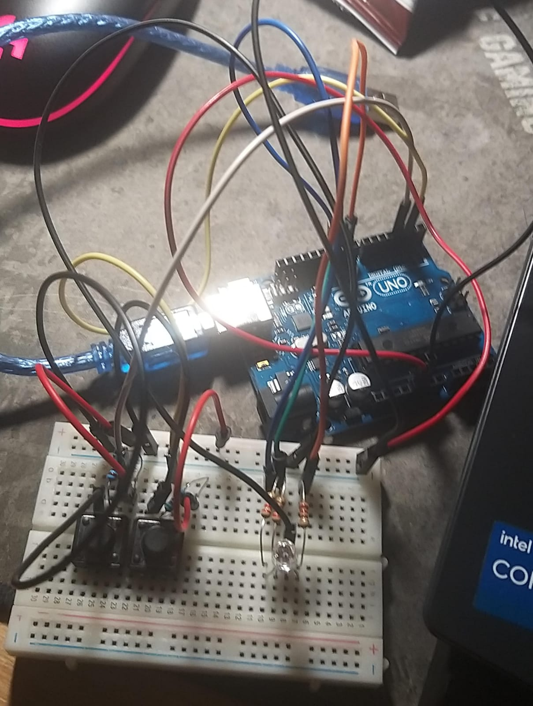

# Type Racer
This project uses an ATMega328P microcontroller (with the Arduino Framework) to emulate a type racer game.

## Table of contents
- [Overview](#overview)
- [Hardware Setup](#hardware-setup)
- [Code Overview](#code-overview)
- [Usage](#usage)


## Overview


## Hardware Setup
### Components
- Arduino UNO board (ATmega328P microcontroller)
- x1 RGB LED - shows if a word was type correctly or not
- x2 push buttons (buttonStartStop - start/stop the round, 
                   buttonDifficulty - selecting the difficulty)
- x3 220Ω resistors
- x2 5K1 resistors (for buttons)
- Breadboard
- Jumper wires

### Connections
- ledPinRed (PIN 9)
- ledPinGreen (PIN 10)
- ledPinBlue (PIN 11)
- buttonStartStop (PIN 2)
- buttonDifficulty (PIN 3)

### Project schematic

## Live circuit

## Code Overview
```
void startCountdown()
```
Starts the timers, while setting the countdown time to
3 seconds.
```
void cycleDifficulty()
```
Changes the difficulty of the game using enum arithmetic.
```
void play/endRound()
```
Handles the inputs and shows the number of correct words at the end.
## Usage
1. After connecting the serial cable to your PC and Arduino board, wait for the RGB LED to turn white.
2. Press buttonStartStop to begin game and the LED will start blinking 3 times. You need to write the word that is displayed on the terminal.
3. After a round end you will see a counter for the correctly typed words.

## Final result
https://youtu.be/pdLlaTGCSkE